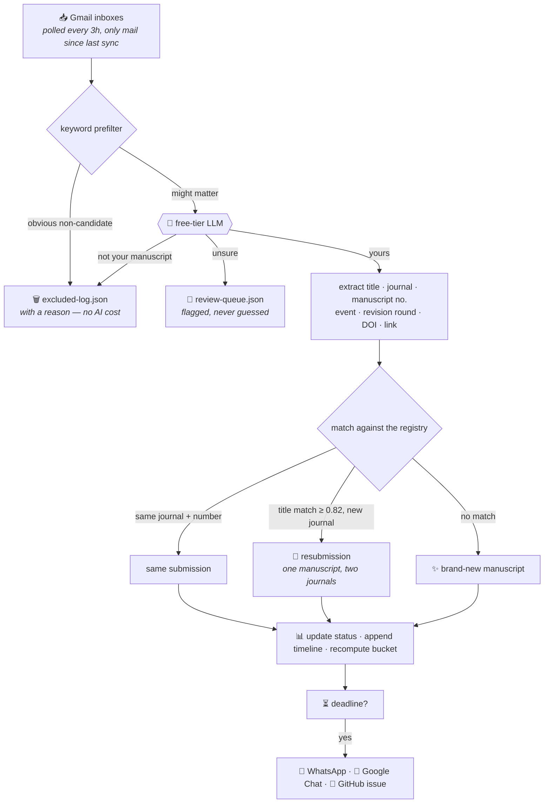

<div align="center">


<br>

**A rejected paper should never be lost in the daily flood of email.**<br>
This watches the inbox so nobody has to.

<br>


</div>

<br>

## What it does

Journals send email. A lot of it, in nobody's particular format, mixed in with
predatory solicitations and invitations to review other people's work. Somewhere
in that stream is the message saying **your** paper was sent back with a
fourteen-day deadline.

This reads all of it, keeps only what is genuinely about your own manuscripts,
and turns each paper into a single record that follows it the whole way:

<div align="center">

**submitted → in review → revision → rejected → resubmitted elsewhere → accepted → published, with DOI**

</div>

A rejection at one journal and a resubmission to the next are **one manuscript**,
not two disconnected entries — so the trail never breaks at the exact moment it
matters most.

<br>

## What you get

<table>
<tr>
<td width="33%" valign="top">

### ⏳ Deadlines that chase you

A paper sent back for edits gets a **countdown**, taken from the journal's own
words where it states one and from that journal's usual window where it doesn't.
Reminders go out on **WhatsApp**, into **Google Chat**, and as a **GitHub issue** —
three channels, none load-bearing alone.

</td>
<td width="33%" valign="top">

### 🧠 Reads mail, costs nothing

A keyword prefilter throws out the newsletters for free; only what survives
reaches a **free-tier LLM**. No paid API, no card, no server. Predatory
solicitations and peer-review invitations are recognised and logged with a
reason, not silently dropped.

</td>
<td width="33%" valign="top">

### ✋ Corrects itself, and takes yours

Every field is re-derived from email every three hours — so a correction you
type by hand is **pinned**, and the sync leaves it alone. Marked *set by hand*
wherever it shows, with a way back to automatic.

</td>
</tr>
</table>

<br>

## How an email becomes a tracked entry



<br>

## The dashboard

Cards are ordered so the thing that gets worse while nobody looks comes first:
**anything on a deadline leads, most urgent at the top**, overdue above due-soon.
Everything else follows by recency.

| Bucket | What's in it |
| :-- | :-- |
| 📤 **Submissions** | Freshly submitted, acknowledged by a journal, awaiting first editorial check. |
| ❗ **Needs action** | Rejected papers to resubmit elsewhere **and** papers sent back for edits before peer review. |
| 🔍 **In review** | Under peer review, revision in progress, transferred, or accepted-awaiting-publication. |
| ✅ **Published** | Published, with DOI and article link. |

A **revision requested** or **sent back for edits** event raises a pulsing action
flag, since both need your work — a revision even though the paper is still
"in review". Those two events also carry a link straight to **the original
email**, because what the editor actually asked for, and the marked-up
manuscript, are in the message rather than in any summary of it.

<br>

## How it is built

| | |
| :-- | :-- |
| **Frontend** | A static dashboard (`index.html` + `assets/`) on GitHub Pages. It reads one JSON file. |
| **Backend** | `scripts/sync-gmail.mjs`, run by GitHub Actions every three hours. Reads Gmail, classifies, commits. |
| **Writes** | A Cloudflare Worker holds the one GitHub token, so no browser ever does. |
| **Database** | There isn't one. **The git repo is the database** — every change to a manuscript is a commit. |

<br>

---

<br>
## One-time setup

### 1. Google Cloud — create OAuth credentials

1. Go to <https://console.cloud.google.com/> and create a project (any name).
2. **APIs & Services → Library →** enable the **Gmail API**.
3. **APIs & Services → OAuth consent screen:** choose **External**, fill the
   required fields. Add every Gmail address you'll track as a **Test user**.

   **Then publish it: click "Publish app" so the status reads "In production".**
   Google expires refresh tokens after **7 days** for apps left in "Testing", which
   would break the sync every week with an `invalid_grant` error. Publishing stops
   that. You will see an "unverified app" warning once, during the authorisation in
   step 2 — click through it (Advanced → Go to *app name*). No Google review is
   needed for personal use.

   **Publish before minting tokens, not after.** The seven days run from when a
   token was issued, not from the app's current status, so publishing does not
   rescue a token minted while the app was still in Testing — it expires on
   schedule and the sync stops with `invalid_grant`. If the app was published
   after tokens were issued, redo step 2 and replace the secrets. It is the
   easiest thing here to get wrong, because everything looks correct right up
   until the day it breaks.
4. **APIs & Services → Credentials → Create credentials → OAuth client ID →
   Application type: Desktop app.** Note the **Client ID** and **Client secret**.

### 2. Mint a refresh token for each inbox

Run locally (Node 18+), once per Gmail account listed in `config/accounts.json`:

```bash
npm install
GMAIL_CLIENT_ID=xxx GMAIL_CLIENT_SECRET=yyy npm run get-refresh-token
```

A browser window opens; **sign in with the specific Gmail account** you're minting
the token for and approve read-only access. The script prints a `refresh_token`.
Repeat for the second account, signing in with that account.

### 3. Add GitHub Actions secrets

In the repo: **Settings → Secrets and variables → Actions → New repository secret.**

| Secret | Value |
| --- | --- |
| `GMAIL_CLIENT_ID` | OAuth client ID from step 1 |
| `GMAIL_CLIENT_SECRET` | OAuth client secret from step 1 |
| `GMAIL_REFRESH_TOKEN_SATHISH` | refresh token for drsathishmuthu@gmail.com |
| `GMAIL_REFRESH_TOKEN_DHIBIN` | refresh token for dhibinvikash1@gmail.com |
| **at least one** classifier key below | see [The classifier](#the-classifier) |

| Classifier secret | Where to get it (all free, no card) |
| --- | --- |
| `GEMINI_API_KEY` | <https://aistudio.google.com/apikey> |
| `CEREBRAS_API_KEY` | <https://cloud.cerebras.ai/> |
| `GROQ_API_KEY` | <https://console.groq.com/keys> |

Leave **Settings → Actions → General → Workflow permissions** on the default
**"Read repository contents and packages permissions"**. Each workflow here
declares the access it actually needs — `contents: write` to commit a sync,
`issues: write` to open a deadline issue — which overrides that default for
that workflow alone. Switching the repository-wide setting to read/write would
grant every future workflow more than it needs, for no benefit.

### 4. Turn on GitHub Pages

**Settings → Pages → Build and deployment → Deploy from a branch →** pick the branch
(`main` once merged) and `/ (root)`. Your dashboard will be at
`https://<user>.github.io/Manuscript-Manager/`.

### 5. Run it

**Actions → Sync manuscript tracker → Run workflow** to do the first sync manually
(the first run looks back 30 days). After that it runs every 3 hours automatically.

---

## Adding or removing an inbox

Edit `config/accounts.json` — add an object with the account's `label`, `email`, and
a `refreshTokenEnv` name, mint a token for it (step 2), add that secret (step 3), and
reference the secret in `.github/workflows/sync-manuscripts.yml`. No code changes.

## Privacy note

This repository is **public**, so `data/manuscripts.json` — your manuscript titles,
journals, and rejection/resubmission history — is publicly readable. If you'd rather
keep that private, make the repo private (GitHub Pages on a private repo needs a paid
plan) or host the data elsewhere.

## Local development

```bash
node scripts/seed-sample.mjs          # writes data/manuscripts.sample.json
cp data/manuscripts.sample.json data/manuscripts.json   # preview only — don't commit
python3 -m http.server 8099           # open http://localhost:8099
```

Before pushing anything, run the checks. None of them need a network, a token,
or a deployed Worker:

```bash
npm run check            # all of the below
npm run check-registry   # how emails fold into the record, and manual edits
npm run check-timestamps # the two clocks per message
npm run check-worker     # the sync proxy, against a stubbed GitHub
npm run check-notify     # deadline reminders: when they fire, and how often
npm run check-editing    # editing in a real browser, end to end
```

`check-editing` needs Playwright (`npm install`); it skips itself with a note
if that is missing.

## The classifier

The engine costs nothing. It runs on permanently free API tiers, and it is built so
that being free never means being less accurate.

**Two models, not one.** The first model classifies the email. Anything it calls
relevant — anything that would create a dashboard entry — plus anything it answers
with less than high confidence is then re-run on a **different** model. If the two
agree, the entry is filed. If they disagree, the email is written to
`data/review-queue.json` with both verdicts rather than being guessed at. A paper is
never silently lost, and junk never silently appears.

**Worked examples, not keyword rules.** The hardest call in this inbox is telling a
peer-review invitation for someone else's paper apart from a decision on your own —
both quote a manuscript number, a title and an abstract. `scripts/lib/classify.mjs`
teaches that distinction with worked examples of each, which is what actually moves a
smaller model's accuracy.

**Provider chain.** Configure one key or all three. They are tried in order and a
rate-limited or failing provider falls through to the next:

| Order | Provider | Free tier | Trains on your email? |
| --- | --- | --- | --- |
| 1 | `gemini-3.7-flash` | ~1,000 req/day (Flash-Lite tier); 1M context | **Yes** — Google may use free-tier content to improve its products |
| 2 | `gemini-2.5-flash` | ~250 req/day | **Yes**, as above |
| 3 | Cerebras `gpt-oss-120b` | ~1M tokens/day | Check current policy |
| 4 | Groq `kimi-k2-instruct` | ~1,000 req/day, ~6K tokens/min | **No** — stated no-training policy |

Free-tier quotas move; treat the numbers as a starting point. Override any model with
`GEMINI_MODEL`, `GEMINI_FALLBACK_MODEL`, `CEREBRAS_MODEL`, `GROQ_MODEL`.

Set `CLASSIFIER_PROVIDERS` to restrict the chain to a comma-separated allowlist, in
the order given — `CLASSIFIER_PROVIDERS=cerebras,groq` keeps email text away from
Gemini's free tier without deleting the key. It is an allowlist, not a preference:
a provider left out of it is not used even with its key set. A provider named in it
but never keyed is dropped, and says so in the log rather than going quiet.

### The second opinion, and why it is off

Every answer that would create a dashboard entry, and every answer the model was
unsure of, can be put past a second, different model. It catches the expensive
mistakes — filing junk, or losing a paper to a wrong "not relevant" — but it
doubles the token cost of exactly those answers, and on free tiers that is the
difference between keeping up with the morning's mail and running dry by ten.

It is **off by default**, because on this repository's history it has never once
earned its price: across 110 manuscripts, 362 timeline entries, 300 excluded-log
entries and the review queue, there is not a single recorded relevance conflict,
event-type conflict or unusable cross-check. Set `CLASSIFY_VERIFY=1` to turn it
back on when quota allows.

Off does not mean credulous. A high-confidence answer is trusted; **anything below
high is flagged for a human** rather than filed unchecked. The doubt goes to a
person instead of to another model — which is the same thing that already happened
whenever no second provider was reachable, so there is one behaviour to reason
about rather than two.

Verify the engine at any time, without needing Gmail access:

```bash
npm run check-classifier                          # full chain
CLASSIFIER_PROVIDERS=cerebras,groq npm run check-classifier
```

It runs three realistic journal emails with known correct answers — including the
reviewer-invitation case free models most often get wrong — and reports which
provider answered, what the cross-check concluded, and whether each was right.
The **Check classifier** workflow runs the same thing with the repository secrets.

> **Privacy:** whichever provider you choose sees the full text of the journal
> correspondence in both inboxes. On Google's free tier that content may be used to
> improve their models. If that matters, set only `GROQ_API_KEY` and
> `CEREBRAS_API_KEY` and leave `GEMINI_API_KEY` unset — the chain works fine with a
> subset. Since a second person's mail is in scope, this is their decision too.

### Staying inside a free quota

Each run classifies at most `MAX_CLASSIFICATIONS_PER_RUN` emails (default 100).
Anything left over is **deferred, not dropped**: its Gmail ID stays out of the seen
list and the sync window is held back to it, so the next run picks it up. The same
holds for an email whose classification failed on a rate limit. A 30-day first
backfill therefore spreads itself across several runs instead of blowing a daily
quota in one go.

## Tuning classification

The triage prompt, worked examples and cross-check policy live in
`scripts/lib/classify.mjs`. The output schema is in `scripts/lib/schema.mjs` and the
provider adapters in `scripts/lib/providers.mjs`. The prefilter keywords are in
`scripts/sync-gmail.mjs`. The fuzzy-title match threshold and bucket rules are in
`scripts/lib/registry.mjs`.


## Opening the dashboard

The page asks for a password before it shows anything. Tick **Stay signed in on
this device** to skip it for 30 days; leave it unticked and the unlock lasts
until the browser closes, or 12 hours, whichever comes first.

Be clear about what that password does and does not do. The page is static:
there is no server to check a password against, so the check happens in the
browser and anyone who opens developer tools can step past it. More
importantly, **this repository is public**, so `data/manuscripts.json` and the
rest can be read directly from GitHub without ever loading the page. The
password stops a passer-by or a shared screen; it does not keep the contents
secret. The only change that does that is making the repository private.

To change the password, replace `PASSWORD_HASH` in `assets/auth.js` with the
SHA-256 of the new one:

```sh
node -e "console.log(require('crypto').createHash('sha256').update('NEW PASSWORD').digest('hex'))"
```

## Correcting a record, and moving one between sections

Open a manuscript and press **Edit**. You can correct the title, journal,
status, manuscript number, DOI or article link, add notes for anything the
email trail does not carry, and move it to a different section.

**What you set by hand stays set.** This matters more than it looks. Every
field on this dashboard is derived from email: the classifier reads each
message and the sync folds it into the record, every three hours. So a
correction that was merely written down would be silently undone by the next
message from the journal — you would fix a title on Monday and find it wrong
again on Tuesday, with nothing to say why.

Instead a manual value is *pinned*. The sync is required to leave it alone,
permanently, and the field is marked **set by hand** wherever it appears. Your
judgement outranks the classifier's until you say otherwise.

**And you can say otherwise.** Each pinned field carries a **use automatic
again** link that hands it back to the sync. Pinning with no way out would turn
one hasty correction into a permanent lie, so the release is part of the
feature, not an afterthought.

Two details worth knowing:

- **Renaming keeps the manuscript whole.** Journals go on sending whatever title
  they were originally given, so the previous title is kept as a matching alias.
  Without that, correcting a title would quietly unhook the record from its own
  future and the next email would open a second copy alongside it.
- **Nothing is lost.** Every edit is recorded in the manuscript's history with
  what changed and when, and the data file is under version control, so any
  change can be read back or undone from the commit log.

Editing needs the sync service deployed (see `worker/README.md`) — it holds the
only credential allowed to write to the repository. Without it there is nowhere
to save to, and the **Edit** button is not offered rather than failing at the
last step. Its token needs **Contents: Read and write** as well as **Actions:
Read and write**; if it only has the latter, saving reports exactly that.

## Deadline reminders on WhatsApp

An amendment — a manuscript returned by the editorial office before peer review
— runs on a clock of five to fourteen days, and missing it usually withdraws
the submission. The tracker works out when each one is due and sends a WhatsApp
message when it is first seen, again at three days and one day out, and once if
it passes.

### Turning it on

Each recipient does this once, on their own phone:

1. Save **+34 613 01 49 37** to contacts. Verify it against
   [callmebot.com](https://www.callmebot.com/blog/free-api-whatsapp-messages/)
   first — this number has already changed once (it used to be +34 644 51 95 23)
   and it will change again. Messaging a stale number is not harmless: the old
   ones get reassigned, so the messages go to a stranger who can read them.
2. Send it exactly: `I allow callmebot to send me messages`
   The bot's own name in the phrase is the literal word `callmebot`, whatever
   you happened to name the contact.
3. It replies `API Activated for your phone number. Your APIKEY is 123123`.

Then add one repository secret, under **Settings → Secrets and variables →
Actions**, named `WHATSAPP_RECIPIENTS`:

```json
[{"name":"Dr Sathish","phone":"9600856806","apiKey":"123456"},
 {"name":"Dhibin","phone":"8778138148","apiKey":"654321"}]
```

Phone numbers live in the secret and never in this repository. That is not
fussiness: this repository is public, and a published number — unlike a token —
cannot be revoked and reissued. A check asserts no number reaches the committed
ledger either.

With the secret unset, nothing is sent and the sync runs exactly as before.

### If no API key comes back

CallMeBot is free and needs no account, which is why it is the default, but it
is one person's side project and it does sometimes not reply. In order:

- Check the number first. It has changed, and a message to the old one is
  delivered and read by whoever holds it now — two blue ticks prove nothing
  about whether the bot ever saw it.
- Check the phrase is exactly `I allow callmebot to send me messages`, with
  the literal word `callmebot` rather than the name you gave the contact.
- Their own advice if nothing comes back within two minutes is to leave it and
  try again after 24 hours. Repeating it every few minutes does not help.

If it still will not answer, the transport is pluggable. Set the
`WHATSAPP_TRANSPORT` repository variable to `twilio` or `meta`.

### Meta's WhatsApp Cloud API

The official route, and the one that does not depend on somebody's side
project. Free for this volume, and it does **not** need business verification:
that is only required past 250 conversations in 24 hours, and this sends a
handful a week.

**1. Create the app.** developers.facebook.com → My Apps → Create App → choose
**Business** → add the **WhatsApp** product. A test WhatsApp Business account
and a free test phone number are created for you.

**2. Add the recipients.** WhatsApp → **API Setup** → under **To**, add each
phone number and verify it with the code WhatsApp sends. The test number
messages **up to five** verified numbers, which is ample. A number that is not
on this list is refused with a bare code; the error here names the person and
where to add them.

**3. Note two values** from that same API Setup page: the **Phone number ID**
and the **Graph API version** shown in its sample request.

**4. Make a permanent token.** The token on the API Setup page expires in 24
hours, so it is only good for a first test. For a real one: business.facebook.com
→ **Business settings → Users → System users** → add a system user with the
**Admin** role → **Add assets** and give it your WhatsApp account with full
control → **Generate new token**, selecting `whatsapp_business_messaging`. That
token does not expire unless revoked.

**5. Create the template.** Meta only accepts free-form text within 24 hours of
someone messaging you, and nobody replies to a deadline reminder — so every
reminder needs a template. WhatsApp Manager → **Message templates** → Create,
category **Utility**, language **English**, named `amendment_deadline`. No
header, no footer, no buttons. One body:

```
Hello, this is an automatic reminder from the Manuscript Manager tracker about a paper that is waiting on you.

Status: {{1}}
Time left: {{2}}
Manuscript: {{3}}
Journal: {{4}}
Due date: {{5}}

Please open the tracker to see the corrections the journal has asked for, and resubmit before the date above.
```

The prose around the placeholders is not decoration, and it cannot be trimmed.
Meta refuses a body on two separate counts here:

- it **begins or ends with a variable** — a "dangling parameter" — so each one
  needs a label like `Status: {{1}}` rather than a bare `{{1}}`;
- it has **too many variables for its length**. Review wants roughly three
  words of fixed text per placeholder plus one, so five placeholders need at
  least sixteen words that never change. A terse label-only body fails this
  even though it reads perfectly well: Meta's concern is that a mostly-variable
  template can be repointed at anything, which is what spam looks like.

The body above carries about forty-five fixed words, comfortably clear of both.
The cap at the other end is 550 characters.

Review asks for a sample of each variable. These match what the code actually
sends, in this order:

| | |
| --- | --- |
| `{{1}}` | `Amendment overdue` |
| `{{2}}` | `3 days left` |
| `{{3}}` | `Obesity in adult spinal deformity surgery` |
| `{{4}}` | `Clinical Spine Surgery` |
| `{{5}}` | `Tue 1 Sep (estimated)` |

Utility templates are usually approved within minutes.

**6. Add the secrets**, then set the repository variable
`WHATSAPP_TRANSPORT` to `meta`:

| Secret | Value |
| --- | --- |
| `META_WHATSAPP_TOKEN` | the system user token from step 4 |
| `META_WHATSAPP_PHONE_ID` | the Phone number ID from step 3 |
| `META_WHATSAPP_TEMPLATE` | the template name from step 5 |
| `META_API_VERSION` | optional; the version from step 3, if the default has been retired |

Meta retires each API version about two years after release, and a retired one
fails with an error that reads like a broken request. If that happens the error
here names the version in use and tells you to set `META_API_VERSION`.

**Twilio** needs `TWILIO_ACCOUNT_SID`, `TWILIO_AUTH_TOKEN` and
`TWILIO_WHATSAPP_FROM`. Its sandbox has the same 24-hour restriction, so a paid
number and an approved template are needed for reminders that fire days apart.

The wording is identical whichever is in use.

### Checking it works, from a phone

The **Test WhatsApp reminders** workflow in the Actions tab is a button for
this. `dry-run` prints what would be sent without sending it, `send-test` sends
one short message to everybody, and `send-real` sends anything genuinely due.
It also reports which recipients are configured and whether each has a key —
by name and last four digits only, since workflow logs here are public.

### Google Chat

The simplest channel that actually works, and the one to prefer. A space has an
**incoming webhook**; posting to it is one HTTPS request with no OAuth, no app
review, no per-person key, and both people see the same space.

1. In Google Chat, open (or create) a space for this.
2. **Space name → Apps & integrations → Webhooks → Add webhooks.**
3. Name it, then **Copy** the URL.
4. Add it as the repository secret `GCHAT_WEBHOOK_URL`
   (**Settings → Secrets and variables → Actions**).

That is the whole setup. Each manuscript posts under its own thread, so one
paper reads as one conversation rather than scattering down the space.

**The webhook URL is a credential.** Anyone holding it can post into that
space, and it cannot be scoped or revoked except by deleting the webhook and
making a new one. It belongs in the secret, never in this repository.

### Also as GitHub issues

Every amendment on a clock also gets a **GitHub issue**, opened automatically,
commented on as the date closes in, and closed once the journal moves the paper
on. This needs no key, no signup and no third party — GitHub pushes to its own
mobile app and to email.

That redundancy is deliberate. A reminder that silently stops arriving is
worse than none, because you stop checking — so there are three channels and
none of them is load-bearing alone. A reminder counts as delivered when any
one of them gets through, and each failing says so rather than taking the
others down with it.

The body is the journal's own list of corrections as a checklist, so the issue
is somewhere to work rather than just an alarm. Set `"githubIssues": false` in
`config/notify.json` to turn it off.

### Sweeping a window the sync missed

The sync is incremental: it keeps a watermark per mailbox and looks only at
mail newer than it. That is right for keeping up and useless for going back —
and a gap did open once, between where the historical backfill stopped and
where the live sync's first window began, losing a Clinical Spine Surgery
amendment with a fourteen-day deadline.

**Actions → Sync manuscript tracker → Run workflow** takes a date range for
exactly this. Give `sync_since` and `sync_until` and it sweeps that window
instead of the usual one, and **does not move the watermark** — moving it would
declare everything up to the sweep's end date as caught up, skipping everything
between the sweep and today.

Mail already decided on stays decided, so a sweep spends classifications only
on what was genuinely never seen. Tick `rescan` to reconsider those too; the
registry dedupes by message id so re-filing is safe, but it costs LLM budget.

### When a date is a guess

A journal that states a date or a period gets taken at its word. When it says
neither, `config/deadlines.json` supplies that journal's usual window, and the
result is labelled **estimated** on the card, in the drawer, and in the
message. A guessed date that looks stated is worse than no date at all — it
invites someone to rearrange a week around a number the journal never gave.
Correct one with **Edit** and the reminders follow your date instead.

## Sync now

The header has a **Sync now** button that runs the Gmail sync immediately
instead of waiting for the three-hourly schedule. It shows a progress ring and
a countdown; the estimate is the median duration of recent runs of this
workflow, not a fixed guess, so it tracks reality as the workflow changes.

The sync itself runs in GitHub Actions — that is the only place the Gmail
refresh tokens exist — so the button has to ask GitHub to start the workflow,
and that requires a token. It cannot be committed here: the repository is
public, so a committed token would be published and revoked within minutes.
Each person supplies their own once, and it is kept in that browser's
localStorage and sent only to `api.github.com`.

Create it at **GitHub → Settings → Developer settings → Personal access tokens
→ Fine-grained tokens**:

| Setting | Value |
| --- | --- |
| Repository access | Only `ORG-Karur-DataCenter/Manuscript-Manager` |
| Permissions | **Actions: Read and write** — nothing else |

A token scoped like that can start and watch workflow runs and do nothing
else: it cannot read repository secrets, push code, or reach any other
repository. **Do not use a classic token with `repo` scope** — that grants far
more than this needs.

You are asked for it **once per device**. After that it is reused
indefinitely; the prompt only returns if GitHub rejects the token or the
browser's data is cleared. To swap it deliberately, use *Use a different
GitHub token* at the bottom of the sync panel.

### Why the token cannot simply be built into the app

The obvious wish is to enter it once and have the app remember it for
everyone, forever. That cannot be done here, and it is worth being precise
about why rather than treating it as a limitation of effort.

The app is a static page: every file it uses is served from this repository,
which is **public**. A token committed here would be readable by anyone on the
internet the moment it was pushed. GitHub's secret scanning would also spot it
and revoke it automatically, usually within minutes — so it would not even
work, let alone be safe. Encrypting it against the app password does not help
either: that password is itself in the public source, so anyone could decrypt
it. Storing it per-browser is not a workaround for a missing feature; it is
the only place a credential can live when there is no server.

If entering it once per device is too much — several people on several phones —
deploy the sync proxy in `worker/`. It is a Cloudflare Worker holding one token
server-side, so nobody is asked for a token anywhere and the credential never
reaches a browser. See `worker/README.md`; it is two commands plus two secret
prompts, and the free tier covers this many times over.

Set `SYNC_PROXY_URL` in `assets/config.js` to the deployed Worker and the
dashboard uses it; leave it empty and the per-device token flow above applies.
Both sit behind the same code path, so switching between them changes nothing
else.

The button targets the branch named in `BRANCH` at the top of
`assets/sync.js`; update it if the deployed branch ever changes.


## Adding an Outlook mailbox

The tracker reads Gmail and Outlook. Each account in `config/accounts.json`
names its `provider`; omit it and the account is treated as Gmail, so existing
entries keep working untouched.

Outlook goes through Microsoft Graph, which needs an app registration. It is
free, and a personal Microsoft account can create one.

### 1. Register the app

[portal.azure.com](https://portal.azure.com) → **Microsoft Entra ID** → **App
registrations** → **New registration**.

| Field | Value |
| --- | --- |
| Name | anything, e.g. `ORG Karur COMMS` |
| Supported account types | **Accounts in any organizational directory and personal Microsoft accounts** |
| Redirect URI | **Public client/native**, `http://localhost:53683/callback` |

That account-type setting matters: pick a narrower one and the token exchange
fails later with an audience error that reads as though the credentials are
wrong.

Copy the **Application (client) ID** from the overview page.

Under **API permissions**, add **Microsoft Graph → Delegated → Mail.Read**.
Read-only is all this needs; it never sends or modifies mail.

A client secret is optional for a public client. If you create one
(**Certificates & secrets**), keep it for the next step; secrets expire, so a
public client with no secret is one less thing to renew.

### 2. Get a refresh token

```sh
OUTLOOK_CLIENT_ID=<client id> npm run get-outlook-token
```

Open the printed URL, sign in as the Outlook account, approve. The refresh
token is printed once — nothing is written to disk.

### 3. Store the secrets

In the repository, **Settings → Secrets and variables → Actions**:

| Secret | Value |
| --- | --- |
| `OUTLOOK_CLIENT_ID` | the Application (client) ID |
| `OUTLOOK_CLIENT_SECRET` | only if you created one |
| `OUTLOOK_REFRESH_TOKEN_DHIBIN` | the refresh token from step 2 |

The next scheduled run picks the mailbox up. A missing credential skips only
that account and logs which variable is absent — a half-configured Outlook
never stops the Gmail inboxes syncing.

### Differences worth knowing

Graph returns the whole message in the listing, so Outlook needs one request
per page rather than one per message — noticeably faster on a backfill.

`/me/messages` spans folders, including Deleted Items. Filtering that out
costs an extra lookup for little gain: seen ids and the registry both dedupe
by message id, so a deleted message is read once and never filed twice.
